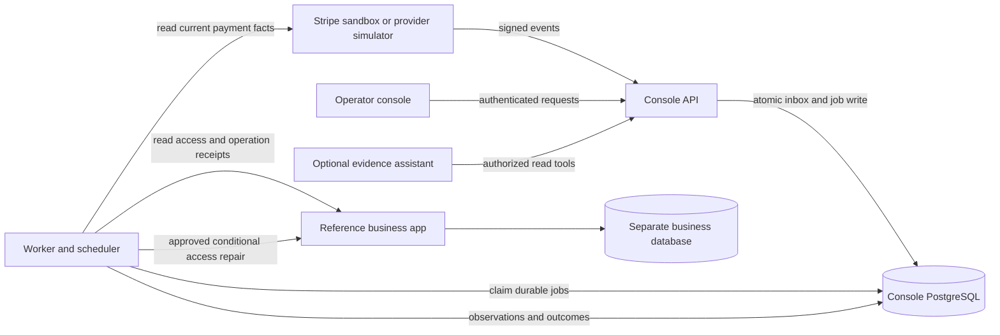

# Architecture and correctness contracts

Status: architecture contract, updated 2026-10-08; Phase 1 foundation and Phase 2
simulator ingestion/evidence are documented in [PHASE-1.md](PHASE-1.md) and
[PHASE-2.md](PHASE-2.md). Stripe integration and later modules remain planned. Implementation must satisfy
[ACCEPTANCE.md](ACCEPTANCE.md). Provider constraints and their official sources
are in [RESEARCH.md](RESEARCH.md).

## 1. System shape

Use a modular backend with separate API and worker processes. The payment
provider and business application are separate authorities; the console records
observations and decisions without becoming either authority.



The reference app shares no transaction or database connection with the console.
It may use a separate database on the same local PostgreSQL instance. Provider
simulation also owns independent state. This exposes the actual commit boundary
that a one-database demo would conceal.

## 2. Module boundaries

| Module | Owns | Interface boundary |
| --- | --- | --- |
| identity | Sessions, subjects, memberships, roles | Resolve authenticated actor and allowed workspace |
| connections | Provider account/environment binding and credential references | Resolve a server-owned connection |
| purchases | Immutable expected values and provider bindings | Register/read a trusted purchase |
| ingestion | Signature verification, inbox, version dispatch | Accept or reject a receipt |
| provider | Current provider reads and canonical normalization | Return observations with completeness/freshness |
| jobs | Durable scheduling, leases, retries, dead jobs | Claim/complete/reschedule with lease fencing |
| reconciliation | Bounded scans and coverage checkpoints | Schedule observations; expose coverage |
| detection | Versioned deterministic policy and discrepancy findings | Pure evaluation of explicit evidence |
| cases | Investigation lifecycle and evidence timeline | Create/update one active discrepancy case |
| repairs | Proposals, approvals, operation identities and outcomes | Approve exact proposal; execute/recover operation |
| business_adapter | Access reads, conditional grants, receipt lookup | Typed remote contract; no arbitrary HTTP tool |
| audit | Actor/decision/attempt/outcome history | Append events without altering old decisions |
| assistant | Sanitized read tools and cited explanation | No execution authority |
| simulation | Seed data and controlled failure injection | Available only in explicitly enabled demo/test environments |

Detection must be callable without a model or a network request. Provider and
business adapters handle network behavior; they do not decide policy. Avoid a
single `agent.py` that owns persistence, policy, and mutations.

Suggested structure: `backend/app/<module>/`, `frontend/`, `reference_app/`,
`tests/unit/`, `tests/integration/`, `tests/e2e/`, `tests/chaos/`, `benchmarks/`,
`fixtures/`, `docs/`, and `infra/`. These are planned paths, not existing code.

## 3. Authorities and immutable expectations

- Provider resources establish observed payment/refund/dispute facts.
- The business app establishes current access and intentional suspension/revocation.
- A server-registered purchase establishes expected customer/product/amount/currency.
- Workspace membership and deterministic policy establish permitted actions.
- A receipt establishes the result of a specific business-app operation.
- The model's response is explanatory output and never an authority.

The business backend creates the checkout/payment and registers the binding.
It writes opaque purchase metadata server-side, including both relevant Checkout
and PaymentIntent metadata when required. The console checks persisted IDs and
provider connection scope; editable metadata alone is not authorization.

`checkout.session.completed` is a trigger to observe, not a payment-success rule.
Retrieve current PaymentIntent/Charge/refund/dispute facts. A PaymentIntent can
remain successful while separate refund/dispute facts make a repair ineligible.
Never update current eligibility from an old success snapshot alone.

The reference app includes a minimal checkout and its own normal idempotent
fulfillment path. Register a purchase and append exact payment-attempt bindings
through trusted integration requests. Use a small reference-app outbox for
registration retries after a console outage. Immutable expectations cannot be
changed by a later binding update. Unmapped early events remain durable and can
be re-observed after trusted registration arrives.

Normal fulfillment and a console repair may race. Both use conditional access
writes and receipts; current active access prevents a second activation. The
reference app records whether its ordinary fulfillment handler ran, failed, or
was delayed, providing evidence for an incident explanation. Failure controls
can interrupt this path explicitly in simulation/test mode.

## 4. First policy: paid purchase with missing access

Version the policy as `one_time_access_v1`. A grant proposal is permitted only
when all of the following hold:

1. An unambiguous, trusted purchase exists for this workspace/customer/product.
2. Provider account and environment match the configured binding.
3. The retrieved PaymentIntent is `succeeded`, with the expected currency and
   fully received amount. `processing`, `requires_action`, and `requires_capture`
   do not satisfy this rule. No zero-price, tax recalculation, or partial-capture
   inference is supported. Multiple known successful payment attempts for the
   same purchase require investigation; equal-value payments for different
   purchases are not inferred to be duplicates.
4. Relevant Charge and refund/dispute observations are complete and current.
   **Any refund or dispute history requires manual investigation in v1**, including
   cases a future policy might allow. This is a conservative product choice.
5. The business app reports a never-activated/inactive grant, not an intentional
   suspension/revocation, an already-active grant, or an unknown response.
6. The product's expected access mapping is explicit and the fulfillment grace
   period has elapsed.
7. There is no other active/unknown repair for the same purchase/action.
8. Evidence has met the configured freshness threshold and the operator is
   authorized to approve this particular action.

At execution, repeat the current provider reads, actor authorization, approval
expiry, policy-version check, expected access revision, and eligibility check.
Content digests exclude observation timestamps so unchanged refreshed facts do
not invalidate a proposal merely because they were read again. A material fact
change invalidates it.

Payment success does not mean payout settlement or actual bank receipt. Missing
fee data from asynchronous capture is pending financial evidence, not necessarily
missing payment. No automated refund, access revocation, or fraud conclusion is
part of this policy.

Track completeness independently for payment facts, refund/dispute facts,
business access, and optional financial/settlement facts. Completeness requires
successful authorized reads, matching scope, all relevant list pages exhausted,
and explicit handling of unavailable fields. A null `balance_transaction` can
leave financial evidence pending while core payment/reversal/access evidence is
complete. An empty result after a failed/denied/partial fetch is never evidence
that no refund/dispute exists. Record each bundle's observation interval; reads
across systems are not an atomic snapshot.

An unmapped provider event remains a visible integration-health finding until a
trusted purchase binding is established. A conflicting binding for a known
purchase produces an awaiting-evidence case. Neither condition permits repair.

## 5. Durable records and constraints

All tenant-owned records carry `workspace_id`; references between them must be
checked by composite foreign keys or equivalent enforced scope constraints.
Use UTC timestamps and explicit content/normalizer/policy versions. Money uses
integer minor units with currency, never binary floating-point arithmetic.

| Record | Essential fields and constraints |
| --- | --- |
| workspace/membership | Subject, role, active/revoked state; unique workspace/subject |
| provider_connection | Workspace, provider, provider_account_id, environment, format/API versions, encrypted credential references; verified connection identity |
| purchase | Customer/product, expected amount/currency, frozen expected access, registered time, trusted reference; immutable financial expectation after registration |
| payment_attempt | Purchase, connection, Session/PaymentIntent IDs; unique connection/provider object binding; multiple attempts allowed |
| inbox_event | Connection, event ID/type, source, environment, API version, event/receipt times, payload hash, encrypted raw payload expiry, handling state; unique connection/event ID |
| observation | Resource ID/type, purchase, source, request generation, observed_at, completeness, normalized facts, content digest, normalizer version |
| job | Minimal workspace/resource IDs, kind, due_at, state, attempts, lease token/expiry, last error class; unique logical work key while active |
| reconciliation_run | Connection, scan kind/window, page progress, high watermark, overlap, start/end, coverage/errors |
| case | Purchase, discrepancy code, generation, state, first qualifying observation, latest evidence refs, dismissal fingerprint |
| repair_proposal | Case, action, target, expected access revision, material-evidence digest, policy version, expiry, state; immutable proposed payload |
| approval | Proposal, actor, decision/time, exact payload digest; append-only decision with unique accepted approval |
| repair_operation | Proposal/approval, stable operation ID, payload hash, state, attempt count, next attempt, verified result refs |
| repair_attempt | Operation, attempt number, lease identity, request/response times, error class, observed receipt; append-only |
| audit_event | Workspace, actor/service identity, entity IDs, event kind, policy/evidence refs, time; append-only |

Core uniqueness rules: one provider payment object maps to one purchase in its
connection; one active case per purchase/discrepancy code; one active or uncertain
repair per purchase/action; one operation identity per approved proposal. A
repeated delivery has no second effect, while distinct legitimate updates remain
processable. Do not deduplicate every `(object ID, event type)` forever.

Indexes support due jobs, expired leases, oldest reconciliation checks, active
cases by workspace/state/age, and event/provider lookups. Use bounded pagination;
avoid scanning raw JSON or the full audit history on every dashboard request.

The reference app separately stores purchase/access bindings, access status and
revision, and operation receipts. It enforces access uniqueness for the relevant
customer/product and rejects a second grant for an already-active target. Store
the purchase responsible for the grant; a repeated purchase must not reset access
or create an unintended second effect.

## 6. Event format and ingestion transaction

Choose a **version-pinned snapshot destination initially** because authenticated
historical snapshots support the incident timeline. Stripe currently recommends
thin notifications for new integrations; this is a deliberate bounded choice,
not a claim about the recommended default. Support one format first and verify
the selected stable SDK/API/destination pair in Phase 0. Current actions still
retrieve resources rather than trusting snapshot state.

Ingress sequence:

1. Resolve the connection from a configured destination identifier.
2. Bound body size (initial configurable limit: 1 MiB), read untouched bytes, and
   validate the signature with recency protection and the connection's secret.
3. Validate provider/account context where supplied, environment, allowlisted
   event type, and supported shape/version. A signing secret alone does not
   establish the purchase mapping.
4. In one transaction insert the inbox receipt and durable job. On a duplicate,
   return success only if the original durable receipt exists; do not delete its
   processing failure or reset job state.
5. Commit, then acknowledge. A failed commit returns a retryable server error.

For authentic but unsupported event versions, persist a quarantined receipt and
raise integration health rather than interpreting its data or endlessly failing
delivery. Malformed/unverifiable payloads are rejected. Record ignored valid
allowlisted/unhandled events explicitly. Backfilled records use source
`provider_api`, not a fabricated webhook signature. Stored-event replay does not
re-run an expired ingress signature check; it uses the original authenticated
receipt and audited replay authorization.

## 7. Jobs, concurrency, and crash behavior

Job states: `queued`, `leased`, `retry_wait`, `completed`, `dead`.

Claim due jobs with a short transaction using row locks and `SKIP LOCKED`; set a
lease identity and expiry atomically. Do not hold database transactions/row locks
across network calls. PostgreSQL explicitly identifies `SKIP LOCKED` as useful
for queue-like tables, not general consistent business reads. [PostgreSQL SELECT](https://www.postgresql.org/docs/current/sql-select.html)

Use lease fencing: heartbeat, completion, reschedule, and projection writes check
the current token/generation. An expired worker cannot overwrite results after
another worker has taken ownership. Use a per-purchase observation generation
or logical lease to stop an older network response from replacing newer facts.

Jobs execute at least once. Their effects are protected by operation identity,
conditional writes, and target receipts. A local lease alone cannot prevent an
old worker's in-flight HTTP request from reaching the remote app.

Dispatch with bounded concurrency and tenant fairness, initially round-robin
eligible workspaces with per-workspace claim caps. Rate-limit provider work by
connection, honor provider retry guidance, and use bounded backoff with jitter.
Separate permanent validation/permission incompatibility from retryable provider
timeouts/429s/5xx. After the attempt limit, expose a dead job and retain recovery
context; redriving it keeps its logical operation identity.

FastAPI in-process background tasks are not the durable execution mechanism.
Async database sessions are per request/task, not shared by concurrent workers.
[FastAPI background task guidance](https://fastapi.tiangolo.com/tutorial/background-tasks/),
[SQLAlchemy concurrency guidance](https://docs.sqlalchemy.org/en/20/orm/extensions/asyncio.html)

## 8. Reconciliation and honest coverage

Two mechanisms are required:

- An overlapping, checkpointed event backfill for supported types within the
  provider's available history. Feed it through the inbox deduplication path.
- Resource/business-state checks for registered purchases, independent of receipt
  delivery. Revisit pending payments, active cases, unresolved repairs, and older
  grants using an oldest-observation sweep bounded by provider budgets.

No universal resource `updated_at` cursor is assumed. A recent-created-payment
window misses later refunds on old purchases. Paginate each implemented resource
read completely and explicitly retain pending progress. Checkpoint only completed
pages/windows; preserve overlap so late events are discovered. Track scan coverage
separately from freshness and disclose partial/failed scans.

The Events API's retention and resend limits are finite. Our retained observations
and current reads cannot reconstruct every historical transition after expiration.
`delivery_success=false` is not a complete incident detector. Show incomplete
coverage and provider unavailability rather than presenting an empty inbox as a
guarantee that everything is healthy.

## 9. Case, proposal, and operation transitions

Case states: `open`, `awaiting_evidence`, `awaiting_approval`,
`repair_in_progress`, `outcome_unknown`, `resolved`, `dismissed`.

- Qualifying overdue mismatch opens a case; incomplete evidence waits.
- An eligible pending proposal moves it to awaiting approval.
- Approved queued/executing work moves it to repair in progress.
- An uncertain external effect produces outcome unknown, not failure.
- Verified matching business state resolves it, including independent manual fixes.
- Dismissal requires an operator reason; suppress the same material-evidence
  fingerprint until a relevant fact changes. Do not silently reopen it every poll.
- A new mismatch after resolution may create a new generation while preserving
  earlier decisions. A successful old operation cannot authorize a fresh grant.

Resolve by discrepancy code, not by a universal `access is active` predicate:

- `PAID_ACCESS_MISSING` resolves after current eligible purchase/access facts agree
  or an operator documents the intentional exception.
- `REVERSAL_ACCESS_REVIEW` opens when a later refund/dispute is observed against
  active or previously repaired access. It requires a documented operator
  disposition; active access does not automatically close it. V1 proposes no
  automatic revocation or refund for this case.
- A known multiple-successful-attempt finding requires an operator disposition;
  the console does not choose a transaction to refund.

Case-code-specific suppression and material-change rules prevent an unchanged
review finding from reopening on every reconciliation poll.

Proposal states: `pending`, `approved`, `rejected`, `expired`, `superseded`.
Operation states: `queued`, `executing`, `retry_wait`, `succeeded`, `failed`,
`outcome_unknown`, `cancelled`.

Approval atomically checks actor/tenant/expiry/version, records the decision,
marks the proposal approved, creates the unique operation/job, and appends audit.
Concurrent approval requests return the existing approved operation or a conflict;
they cannot enqueue distinct operations. Execution marks `executing` durably
before dispatching the external request.

Revoke/cancel only before dispatch where cancellation can be established. Once a
remote request may be in flight, cancellation is not proof that no effect happened.
An actor's revoked membership blocks a queued operation at revalidation. Already
dispatched remote requests can require outcome lookup and investigation.

## 10. Business-app repair contract

The following are application endpoints, not Stripe endpoints:

```text
GET  /internal/access/{purchase_id}
POST /internal/access-grants
GET  /internal/operations/{operation_id}
```

Authenticated reads return workspace/purchase/customer/product binding, explicit
access status, revision, observation time, and intentional-block reason where
applicable. Outcome lookups use authoritative primary reads, not a lagging replica.

The grant request includes operation ID, purchase/customer/product, exact expected
revision/state, policy/proposal reference, and expiry. The target verifies its own
binding and the console credential's allowed workspace; request fields are not
permission. The target authenticates before revealing an operation receipt.

In one target transaction:

1. Look up/claim the unique operation ID and verify its canonical payload hash.
2. Return its stored receipt on an identical completed request; reject a changed
   payload with the same ID.
3. Compare expected revision/state against current access and verify that access
   is not already active or intentionally blocked.
4. Apply the access change, increment revision, and record its receipt atomically.

A concurrent duplicate request must wait for the first transaction or receive a
bounded pending/conflict response; it must not perform a second change. Stable
identity plus conditional target writes also protects against two independent
console operations aimed at the same access record.

After a timeout, preserve `outcome_unknown` and query the receipt/current access.
Retry only with the same operation identity and payload when the adapter contract
makes that safe. A temporarily missing receipt does not prove a request never
arrived; another transaction may still be in progress. Without this contract,
the connector supports investigation only and cannot advertise automated repair.

Retain receipts and identity tombstones for the maximum allowed retry/replay
horizon; preserve outstanding-operation receipts and access provenance through
retention/deletion work. Do not permit arbitrary ancient replay after receipt
retention has expired.

## 11. Residual races and honest guarantees

There is no distributed transaction between provider eligibility and target
access. A refund/dispute may appear after the last provider read but before or
after the grant. Minimize the window through immediate checks and conditional
target writes, then detect later changes through reconciliation. Grant policy
cannot promise to prevent every such race.

The initial response to a later refund/dispute is an investigation requiring
human policy, not an automatic revocation/refund. A target receipt can prove a
grant occurred; it cannot prove access is still active after a later administrator
change. Keep historical operation success separate from current case resolution.

Guarantees to test: durable receipt after acknowledgment, fenced local progress,
scope isolation, consistent approved payload, and bounded idempotent access effects
under the declared target contract. Universal exactly-once processing and global
financial correctness are explicitly not guarantees.

## 12. Console API outline

| Method/path | Purpose and constraints |
| --- | --- |
| `GET /api/workspaces` | Only memberships for the authenticated subject |
| `POST /api/purchases` | Trusted integration credential; immutable expectations; idempotent registration |
| `POST /api/purchases/{id}/payment-attempts` | Trusted append-only binding registration; exact account/environment/object validation |
| `POST /webhooks/stripe/{destination_id}` | Raw signed receipt; no browser session; connection-bound scope |
| `GET /api/cases` | Authorized workspace, bounded cursor/filter fields |
| `GET /api/cases/{id}` | Authorized case, evidence and current freshness |
| `POST /api/cases/{id}/refresh` | Enqueue bounded observation; returns job reference |
| `POST /api/cases/{id}/proposals` | Deterministic preview; no model-generated executable action |
| `POST /api/proposals/{id}/approve` | Operator/owner; payload-bound request identity; atomic operation enqueue |
| `POST /api/proposals/{id}/reject` | Operator/owner; recorded reason |
| `GET /api/operations/{id}` | Current state, attempts, verified/unknown outcome |
| `POST /api/cases/{id}/dismiss` | Operator reason and evidence fingerprint |
| `GET /api/integrations/health` | Coverage, freshness, backlog and error classes |
| `GET /api/audit` | Scoped, redacted, bounded pagination |
| `POST /api/cases/{id}/explain` | Optional bounded AI request with explicit capability state |
| `POST /api/demo/scenarios/{name}` | Isolated synthetic demo only; no live connector |

Use structured errors with stable codes, request IDs, and retryability. Distinguish
authorization failure, stale precondition, unsupported integration, rate limit,
provider unavailability, and unknown external outcome. An HTTP 202 indicates
accepted work, never completed business repair.

## 13. Identity, isolation, and data handling

Viewer: read authorized cases/evidence. Operator: investigate, request/approve/reject
access proposals, and dismiss with a reason. Owner: those capabilities plus
membership/connection/policy configuration. Integration credentials register
purchases and report business facts; they cannot approve repairs. Service workers
execute already-approved operations through bounded service credentials.

OIDC authenticates an identity; console memberships supply authorization. Store
sessions server-side with revocation and secure cookies; avoid browser localStorage
for bearer credentials. CSRF-protect browser mutations, rate-limit expensive
refresh/explanation/approval endpoints, and use finite request/response sizes.

Apply tenant scope in repositories and PostgreSQL row-level security. Set trusted
workspace/subject context per transaction from verified membership; reset it
automatically at transaction end. Use non-owner database roles; owners/superusers
can bypass ordinary RLS, so production workers must not accidentally use those
roles. Queue dispatch may read minimal routing identifiers across tenants; payload,
evidence, and mutations remain scoped to the claimed job's workspace.
[PostgreSQL row security](https://www.postgresql.org/docs/current/ddl-rowsecurity.html)

Reconciliation and jobs must validate their stored resource scope; never trust a
model/client to choose the workspace. Test connection-pool reuse, IDs from another
workspace, adapter credentials, and AI evidence references. Internal service trust
is an explicit boundary; RLS does not make a compromised authorized worker harmless.

Audit records are append-only through the application role. They are not claimed
tamper-proof against a database administrator. Redaction/retention uses controlled
jobs and preserves decisions' referential integrity. No card data or secrets are
stored in prompts or customer metadata. Simulation routes and local authentication
shortcuts are disabled or tenant-isolated in any externally reachable deployment.

## 14. Growth decisions

Optimize measured queries/indexes and worker fairness first. Add workers with
bounded DB connections before introducing a broker. If an external broker becomes
necessary, publish through a transactional outbox and verify relay recovery.
Use read replicas only for evidence views whose staleness is explicit; approval,
target preconditions, and operation lookup require authoritative reads.

Split modules into independent services only when deployment/load/team boundaries
justify it. Cache non-authoritative summaries with visible age; keep repair
eligibility fresh. Retain a modular design so subscriptions, providers, and finance
extensions can add policies/adapters without rewriting execution safety.
