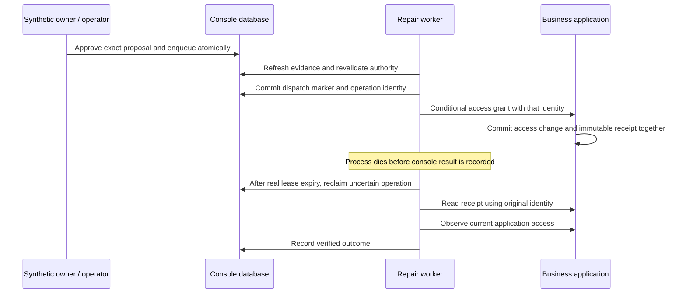

# Recovering payment access when a remote outcome is uncertain

This is a local synthetic engineering project. Customer demand and production
Stripe acceptance remain unvalidated. The business action is an application
access grant, not a charge or refund. The implementation was developed with AI
assistance; the reasoning and evidence below should be understood and defended
by the project author rather than presented as unaided original research.

## The failure window

A customer has one registered purchase, a qualifying successful payment, and
inactive application access after the real fulfillment grace period. An operator
approves a proposal tied to exact evidence, target revision, payload, and expiry.
The business application commits the access grant and its operation receipt in
one PostgreSQL transaction. The console worker then dies before recording the
receipt or verifying current access.

The target has succeeded while the console has incomplete knowledge. An absent
console result does not establish failure. A receipt lookup returning 404 also
does not establish that no request is in flight or that an effect never occurred.



## Decisions and alternatives

| Decision | Reason and tradeoff |
| --- | --- |
| A PostgreSQL inbox/job transaction | Acknowledgment follows durable receipt and job persistence. Avoids a database/broker dual-write gap; database scheduling capacity becomes a measured limit. |
| Current evidence instead of event-order inference | Duplicated, reordered, or omitted notifications cannot establish current refund/access state alone. Additional authoritative reads cost time and provider budget. |
| Conditional target change plus atomic receipt | The target serializes the access revision and records the outcome in the same transaction. Requires an application adapter with these semantics; arbitrary external APIs cannot be assumed to provide them. |
| Payload-bound approval | Approval permits a particular target and action. Roles, evidence, policy, revision and expiry are rechecked before dispatch. A provider reversal can still race after the final read; this is not a distributed atomic transaction. |
| Dispatch marker before the call | After a crash, the console knows a call might have happened. A crash before the network call can therefore leave a conservative unknown outcome requiring operator investigation. |
| Receipt lookup after uncertain dispatch | Recovery preserves the original identity and avoids a second dispatch. A missing receipt retains uncertainty rather than inventing a replacement operation. |
| Fresh access observation after receipt | A historical grant receipt remains true even if access was subsequently suspended. Receipt existence alone cannot establish present business recovery. |
| Per-workspace job rounds and request budgets | Work is bounded and scopes remain explicit. A single sequential worker can still delay another workspace during a slow read; round-robin order is not a latency guarantee. |
| Durable refresh at the grace deadline | The initial benchmark exposed delayed detection after grace. Reuse the leased job's `due_at` to schedule a follow-up, committed with observation publication. New queued-job notifications bring it forward; provider retry backoff remains intact. This adds a read and removes dependence on a future sweep, but cannot guarantee prompt service under overload. |

Operation receipts are a familiar reliability technique. The contribution here is
their concrete integration with eligibility, human approval, isolated workspaces,
recovery state, and reproducible failure evidence. No algorithmic novelty or
universal exactly-once guarantee is claimed.

## Reproduce the demonstration

Follow [the local runbook](RELEASE-RUNBOOK.md), then run:

```powershell
python scripts/demo_recovery.py
```

This **test harness approves only its own generated synthetic fixture** through
the owner API. It briefly stops the console worker so an existing integration
fault hook can kill a separate child at the specific post-commit boundary. The
normal worker is restarted in `finally`. Grace and lease clocks are not edited.
The other services continue running. Run it separately from integration suites
and load tests. A trace is written under ignored `.local/demonstrations`.

Required observable evidence: target active at revision 1 after the crash, console
without a recorded receipt, one dispatch attempt, later receipt lookup, unchanged
target revision, a verification observation, and a resolved case. Assertions fail
if those outcomes do not hold. See [the finishing record](PORTFOLIO-FINISH.md)
for recorded results rather than treating this procedure as evidence of a pass.

## What the performance experiment asks

An isolated crash repeat revealed a second failure mode: ordinary delivery
resolved the case before operation recovery, and later reads left that resolved
case behind the evidence head. Receipt lookup succeeded, but verification failed
closed. The correction keeps healthy resolved missing-access cases current
without reopening them or repeating resolution audit entries. The regression
reproduces delivery resolution, a subsequent observation, and recovery in that
order. Both the failed trace and the correction's verification are preserved in
the finishing record.

Webhook acknowledgment is only the first stage. The benchmark measures receipt
arrival to a matching complete observation, then to the expected policy decision.
For missing access, it separately reports detection after the durable first
success confirmation plus the real 120-second grace. Normal fulfillment, failed
payments and refunds exercise negative cases. No approvals are performed by the
benchmark, so any repair operation for its fixtures is an oracle violation.

It runs distinct purchases in both supported workspaces, adds noisy notifications
to workspace A, and optionally restarts the worker. Existing purchases are
preserved and their counts reported. Both workspaces share the worker: results
show progress under this particular workload, not universal fairness or a global
freshness bound. Timeout/missing outcomes stay in the denominator.

## Questions the author should be able to answer

1. Why is committing a dispatch marker before HTTP safer, and what uncertainty
   can that introduce if the process dies before actually sending the request?
2. Why do both an immutable receipt and a current access observation matter?
3. Why can't one database lease make a remote HTTP action globally atomic?
4. Which faults are tested with actual processes and transactions, and which
   depend on simulator controls or test-specific database fixtures?
5. What does the measured ingress latency establish, and which downstream costs
   do investigation measurements include?
6. How do rate budgets limit achievable refresh intervals as inventory grows?

The measured limits and remaining scope are recorded in
[PORTFOLIO-FINISH.md](PORTFOLIO-FINISH.md) and [PHASE-5.md](PHASE-5.md).
